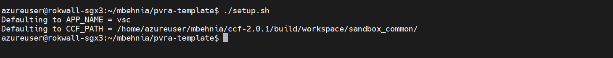
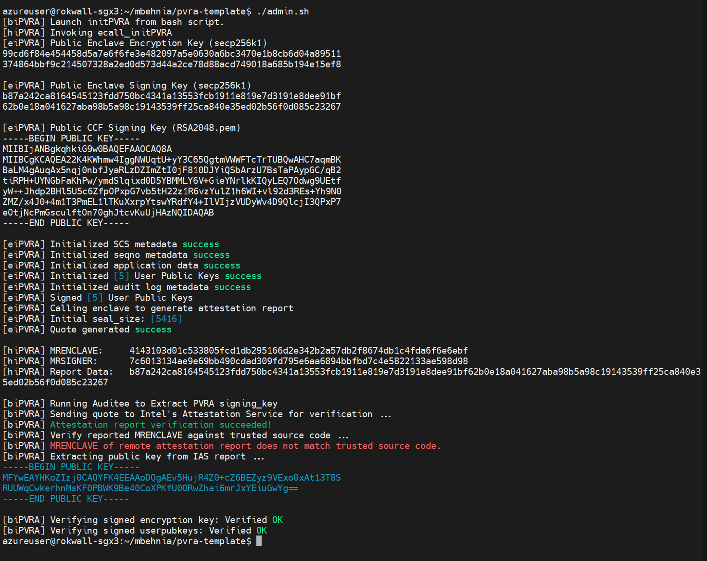
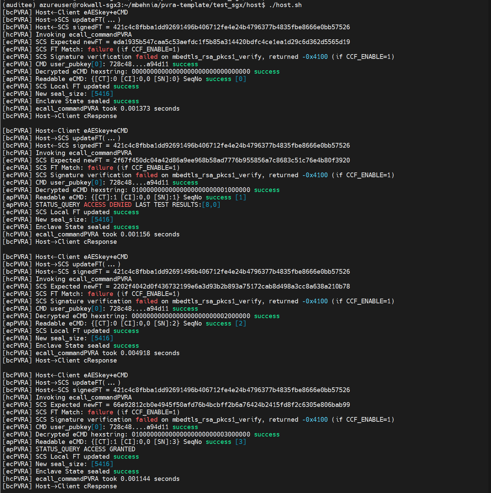
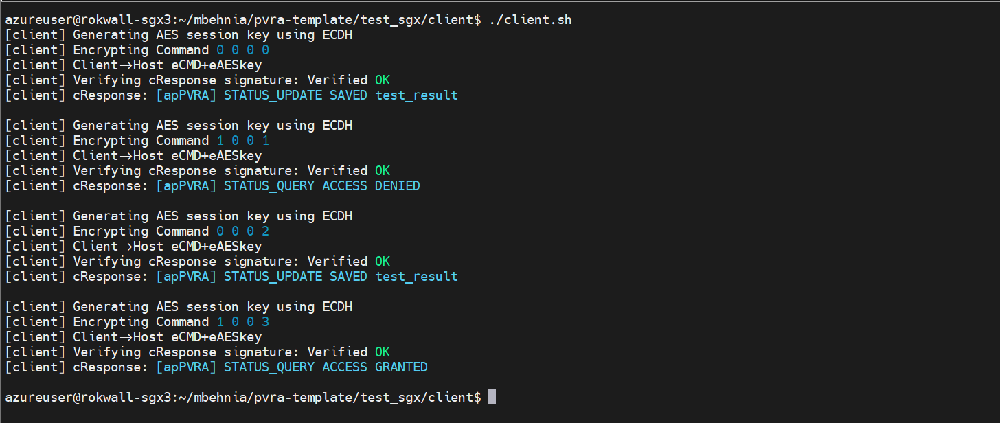

# PVRA Template

<!-- ABOUT THE PROJECT -->
## About The Project

PVRA (Publically Verifiable Remote Attestation) aims to provide a framework for developers to bootstrap a range of auditting capabilities and security properties for their enclave based applications that are otherwise vulnerable.

The goal of this template is to provide a clean interface with PVRA framework components and an intuitive means of writing these applications. We have four example applications to showcase: VirtualStatusCard, HeatMap, EVoting, and SecureDataTransfer. To browse the trace of a PVRA application refer to ```./applications/```. VSC is currently at 229 LoC and HeatMap at 205 LoC.

## Quick Start
Run an existing application secure data transfer (sdt) in docker without CCF in SGX simulation mode

* set Environment variables

```bash
export PROJECT_ROOT=$(pwd)
export CCF_ENABLE=0
export SGX_SPID=None
export IAS_PRIMARY_KEY=None
export NUM_USERS=5
export APP_NAME=sdt
export SGX_MODE=SW
```

* build and run docker image

```bash
cd $PROJECT_ROOT/docker
./run.sh
```

## Getting Started

### How to write a PVRA application:

There are five application-specific files that need to be modified for implementing an application.

1. ```appPVRA.h``` This is the header file for the application; it defines the types of commands the enclave processes, the structure of command inputs/outputs, and the structure of application data.

2. ```appPVRA.c``` This is enclave executable application code. Every command should have an associated execution kernel. There are two auxillary functions that are required: 

   - [ ] ```initES()``` initializes the application data structures
   - [ ] ```initFP()``` which associates functions to enumerated commands (COMMAND<sub>0</sub>-COMMAND<sub>N</sub>);
     - optional: add admin specific commands by defining `NUM_ADMIN_COMMANDS` and initializing them to the end of function list
   - optional: user accounts auditing with merkle tree by setting ```#define MERKLE_TREE```
     - [ ] ```get_user_leaf``` generate a list of leaf nodes for each user account

3. ```application.py``` This is a python file that specifies generates user input data and admin input data for deploying the application

   - [ ] ```get_test_data``` Returns data for testing application functionality
   - [ ] ```get_test_data_omission``` Returns data for testing data omission scenarios
   - [ ] ```format_command``` convert test data to serialized C `struct private_command`.
   - [ ] ```print_cResponse``` convert serialized C `struct cResponse` to a printable python string
   - optional: user accounts auditing with merkle tree by setting ```constants.MERKLE(True)```
     - [ ] ```print_leaf``` convert serialized C struct generated in ```get_user_leaf``` to a printable python string


### How to compile and run a PVRA application:


#### Prerequisites

* Environment variables

```bash
export PROJECT_ROOT=$(pwd)
export CCF_ENABLE=<0 or 1>
export SGX_SPID=<SGX_SPID>
export IAS_PRIMARY_KEY=<IAS_PRIMARY_KEY>	
export NUM_USERS=<NUM_USERS>
export APP_NAME=<APP_NAME>
export SGX_MODE=<HW or SW>
```

* CCF public key is hardcoded in the enclave image as a root of trust and must be updated in initPVRA.c. In order to run the demo without SCS protection, one can ```export CCF_ENABLE=0```._

* In order to run an existing application pass the APP_NAME to ```./setup.sh``` script.
  
    * ```setup.sh``` takes as arguments ```-a <APP_NAME>``` the name of the directory in `$PROJECT_ROOT/application` and ```-c <CCF_PATH>``` the directory that contains the credentials for communicating with the running CCF network. If no arguments are passed it uses the VSC application. ```--clean``` undoes the effects of the script._

```bash
./setup.sh -a $APP_NAME
```

#### Usage

##### Use Docker

* Hardware mode
```bash
export SGX_MODE=HW
cd $PROJECT_ROOT/docker
docker-compose build enclave
docker-compose run --rm enclave bash
```

* Simulation mode
```bash
export SGX_MODE=SW
cd $PROJECT_ROOT/docker
docker-compose build enclave-sim
docker-compose run --rm enclave-sim bash
```

##### Build Locally
* python 3 required

```bash
pip install -r requirements.txt
export SGX_SDK=/opt/sgxsdk #or your local sgx sdk path
export LD_LIBRARY_PATH=$SGX_SDK/sdk_libs:$LD_LIBRARY_PATH
export SGX_MODE=<HW or SW>
cd $PROJECT_ROOT/scripts
./build.sh
./run_BB.sh
export BILLBOARD_URL="http://$(docker inspect -f '{{range.NetworkSettings.Networks}}{{.IPAddress}}{{end}}' billboard):8545"
```

#### Run python scripts

* run demo with ```get_test_data``` output
    ```bash
    python demo.py demo <optional: NUM_USERS>
    ```
* run test with ```get_test_data``` output (checks the expected responses and leaf nodes for correctness)
    ```bash
    python demo.py test <optional: NUM_USERS>
    ```
* run data omission demo with ```get_test_data_omission``` output
    ```bash
    python demo.py data_omission_demo <optional: NUM_USERS>
    ```

### Cleanup

#### Stop docker containers

* Docker deployment

```bash
cd $PROJECT_ROOT/docker
docker-compose down
```

* Local deployment
```bash
cd $PROJECT_ROOT/scripts
./stop_BB.sh
```
	
### Sample VSC Run:










