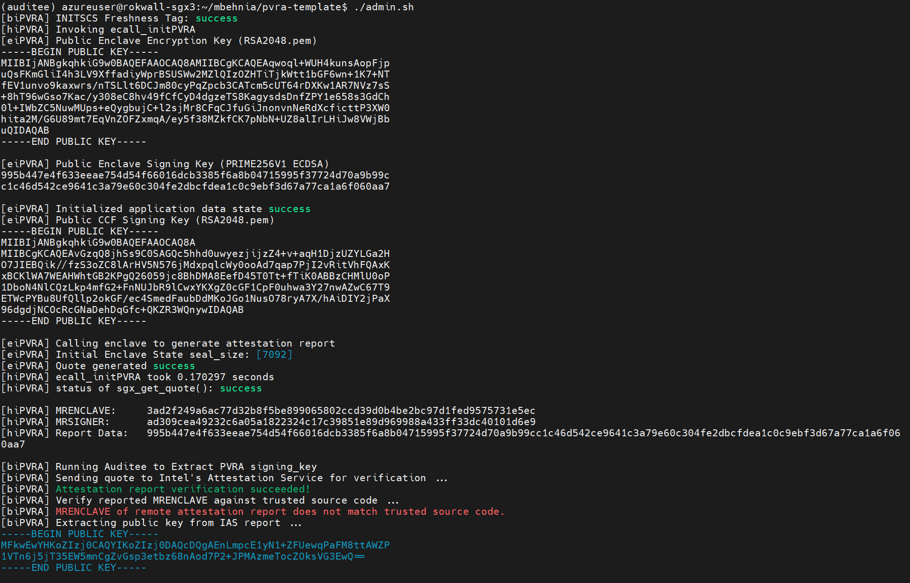

# PVRA Template

How to compile and run a PVRA application:

Edit enclave/appPVRA.h and enclave/appPVRA.c based on application functionality
Edit host.sh and client.sh based on host/client behavior model 

Note: ./format_command program also needs to be rewritten based on application command format

```
make
./admin.sh

Terminal 1:
cd ./test_sgx/host
./host.sh

Terminal 2:
cd ./test_sgx/client
./client.sh
```

Sample Run:




