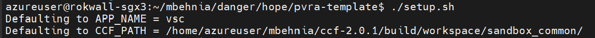
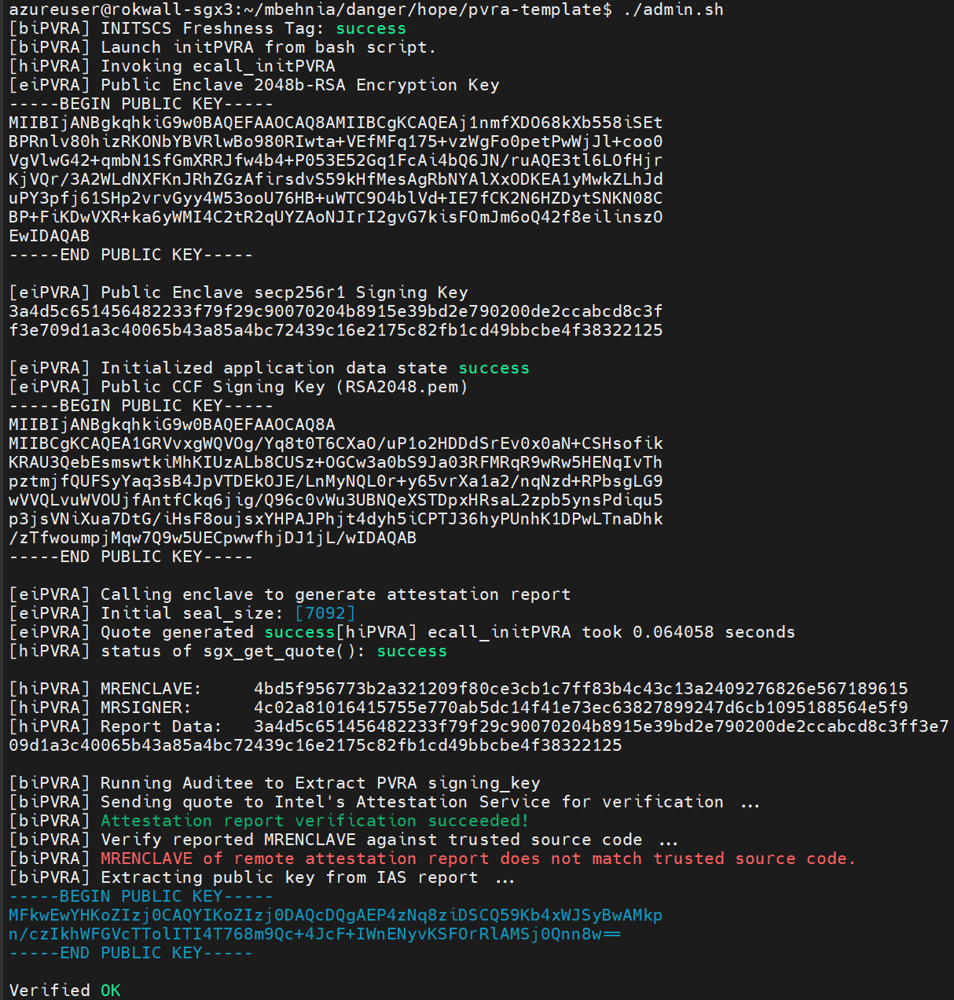
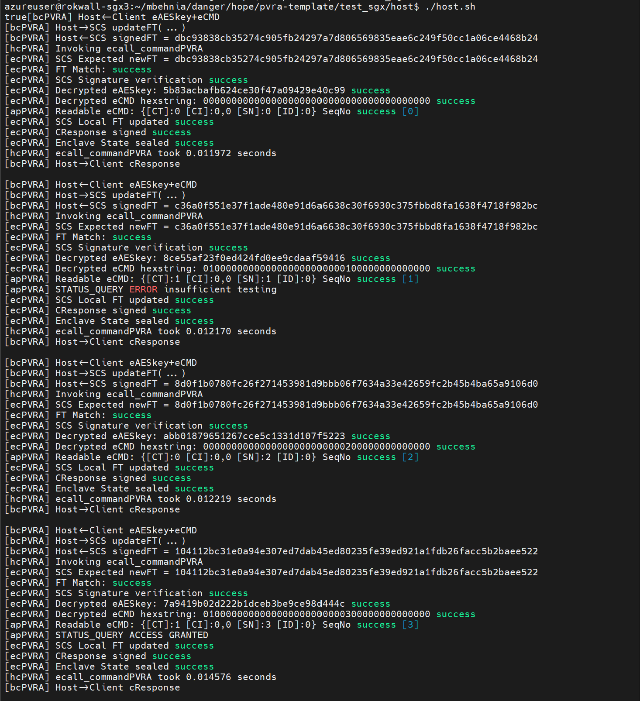
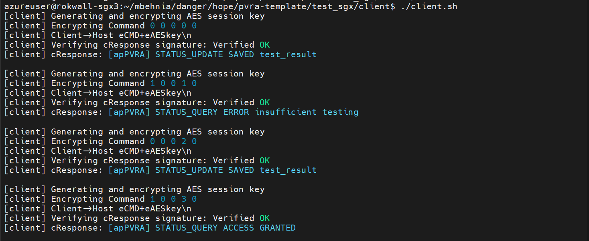

# PVRA Template

<!-- ABOUT THE PROJECT -->
## About The Project

PVRA (Publically Verifiable Remote Attestation) aims to provide a framework for developers to bootstrap a range of auditting capabilities and security properties for their enclave based applications that are otherwise vulnerable.

The goal of this template is to provide a clean interface with PVRA framework components and an intuitive means of writing these applications. We have four example applications to showcase: VirtualStatusCard, HeatMap, EVoting, and SecureDataTransfer. To browse the trace of a PVRA application refer to ```./applications/```. VSC is currently at 153 LoC and HeatMap at 171 LoC.

## Getting Started

### How to write a PVRA application:

There are five application-specific files that need to be modified for implementing an application.

1. ```appPVRA.h``` This is the header file for the application; it defines the types of commands the enclave processes, the structure of command inputs/outputs, and the structure of application data.

2. ```appPVRA.c``` This is enclave executable application code. Every command should have an associated execution kernel. There are two auxillary functions that are required: ```initES()``` which initializes the application data structures, and ```initFP()``` which associates functions to enumerated commands (COMMAND<sub>0</sub>-COMMAND<sub>N</sub>);

3. ```host.sh``` This is a script that defines the untrusted host or enclave administrator's behavior. In the examples provided the simple host waits for client commands, executes them, and returns the associated cResponses.

4. ```client.sh``` This is a script that defines the client behavior. It is mainly setup for testing purposes, to simulate multiple client commands in a sequence sent to the host for execution.

5. ```format_command``` This is a C program executable that takes as input space-deliminated arguements, places them in a private_command struct and outputs the raw binary information ready for encryption. The result is fed to the ```encrypt_command``` executable which AES-128-GCM encrypts the binary file.

    - [ ] The reason this is currently in C was because ```openssl enc``` does not support AEAD for aes-128-gcm


### How to compile and run a PVRA application:


#### Prerequisites

In order to run an existing application pass the APP_NAME to ```./setup.sh``` script.

- [ ] Add python requirements, make, gcc, etc.


#### Usage

* Build the application and initialize the enclave + client/host environments. 
	```
	export CCF_ENABLE=<0 or 1>
	./setup.sh -a|--app <APP_NAME> -c|--ccf <CCF_PATH>
	make clean
	make
	export SGX_SPID=<SGX_SPID>
	export IAS_PRIMARY_KEY=<IAS_PRIMARY_KEY>
	./admin.sh
	```
	_```setup.sh``` takes as arguments ```-a <APP_NAME>``` the name of the application directory and ```-c <CCF_PATH>``` the directory that contains the credentials for communicating with the running CCF network. If not arguments are passed it uses the VSC application. ```-clean``` undoes the effects of the script._

	_CCF public key is hardcoded in the enclave image as a root of trust and must be updated in initPVRA.c. In order to run the demo without SCS protection, one can ```export CCF_ENABLE=0```._

	_```SGX_SPID``` and ```IAS_PRIMARY_KEY``` are EPID parameters required for generating SGX  *unlinkable* quotes and reports from IAS. To enroll in Intel SGX Attestation Service refer to: https://api.portal.trustedservices.intel.com/EPID-attestation_

	- [ ]  Auditee: admin.sh sources a python venv for auditee, give instructions on how to setup that python environment and isolate that from admin.sh script

	- [ ]  Auditee: MRENCLAVE MATCH FROM DOCKER BUILD


* Running the Host.
	```
	Terminal 1:
	cd ./test_sgx/host
	./host.sh
	```

* Running the Client.
	```
	Terminal 2:
	cd ./test_sgx/client
	./client.sh
	```


## Bulletin Board Integration Check-list

- [ ] ```./admin.sh``` 
	- [ ] ```init_BB.py```
	- [ ] ```gen_client_keys.py```
	- [ ] POST ```ias_report.json``` to BB
	- [ ] COPY USER KEY PAIRS TO ./client
	- [ ] COPY USER ECDH SCRIPT TO ./client

- [ ] ```pvraClientCommand.sh``` 
	- [ ] ```client_ecdh.py```


- [ ] ```./applications/<APP_NAME>/client.sh``` GET ```ias_report.json``` from BB

- [ ] ```./applications/<APP_NAME>/host.sh``` POST signed AUDIT_LOG to BB


### Sample VSC Run:










